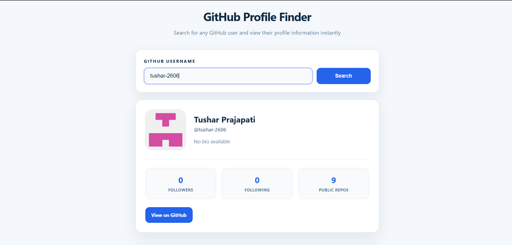

# GitHub Profile Finder

## Overview

This is a GitHub Profile Finder web application developed using HTML, CSS, and JavaScript. The application allows users to search for GitHub profiles and view public profile information using the GitHub REST API.

The project demonstrates API integration, dynamic data rendering, loading states, and error handling while maintaining a clean and responsive user interface.

## Features

* Search GitHub users by username
* API Integration using Fetch API
* Dynamic Profile Display
* Loading State
* Error Handling
* Responsive Design
* Modern User Interface
* Direct GitHub Profile Access

## Technologies Used

* HTML5
* CSS3
* JavaScript
* Fetch API
* GitHub REST API

## Live Demo

synent-task6-api-integration-tushar.vercel.app

## GitHub Repository

https://github.com/tushar-2606/synent-task6-API-Integration-tushar

## Project Structure

```plaintext
API-INTEGRATION/
│
├── index.html
├── style.css
├── script.js
├── README.md
│
└── screenshots/
    ├── home.png
    └── output.png
```

## Screenshots

### Home Page


### Output Screen




## API Used

GitHub Users API

Endpoint:

https://api.github.com/users/{username}

## Installation

Clone the repository:

```bash
git clone https://github.com/tushar-2606/synent-task6-API-Integration-tushar
```

Open the project folder and run:

```plaintext
index.html
```

## How It Works

1. Enter a GitHub username.
2. Click the Search button.
3. The application fetches data from the GitHub API.
4. Profile information is displayed dynamically.
5. If the username does not exist, an error message is shown.

## Learning Outcomes

Through this project, I improved my understanding of:

* API Integration
* JavaScript Fetch API
* Asynchronous Programming
* Dynamic DOM Manipulation
* Error Handling
* Loading State Management
* Responsive Web Design
* Git and GitHub Workflow

## Author

Tushar Prajapati

## License

This project was created for learning and internship purposes.
